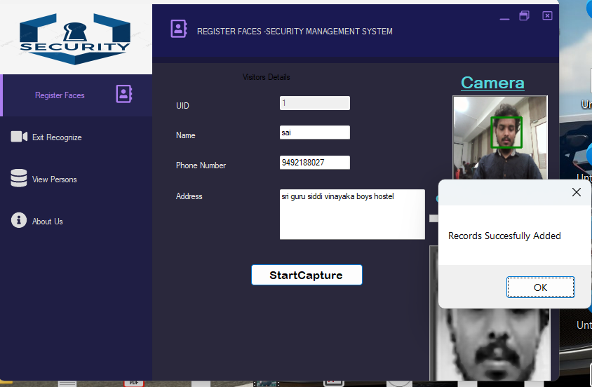
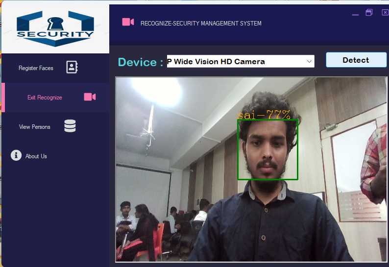
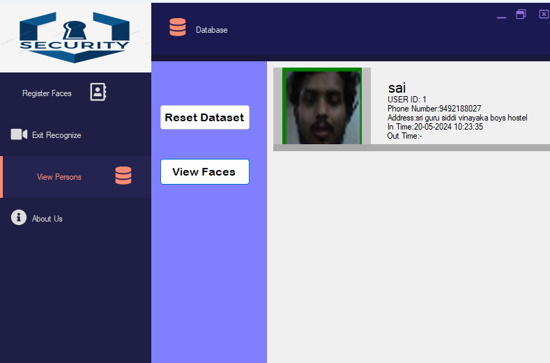

# 👁️‍🗨️ Face Detection Security System

**Face Detection Security System** is a C# Windows application built using the **.NET Framework**, **Windows Forms**, and **Emgu CV** (OpenCV wrapper for .NET). It provides a reliable, real-time facial recognition solution for managing secure building access and monitoring individual entry and exit.

---

## 🔐 Overview

This system is designed to:
- 🧠 Detect and recognize faces using live webcam feeds
- 🚪 Manage entry and exit logs automatically based on facial recognition
- 🧾 Maintain accurate and timestamped records for all recognized individuals
- 🛡️ Enhance security through a touchless and non-intrusive process

---

## 🧰 Tech Stack

- **Language:** C#  
- **Framework:** .NET Framework (Windows Forms)  
- **Library:** Emgu CV (OpenCV for .NET)  
- **Platform:** Windows Desktop

---

## 🖼️ Screenshots


|  |  |
|-----------------------------------------|-----------------------------------------------------|
|  |  |

---

## ⚙️ How It Works

1. **Face Capture:** Captures frames from a live webcam feed
2. **Detection:** Uses Emgu CV's Haar cascades to detect faces
3. **Recognition:** Matches faces with pre-trained data
4. **Access Control:** Automatically logs entry/exit events with timestamps

---

## 🚀 Setup & Run

> Prerequisites: Visual Studio + Emgu CV + .NET Framework (4.x)

1. Clone or download the project:
```bash
git clone https://github.com/yourusername/face-detection-security.git
